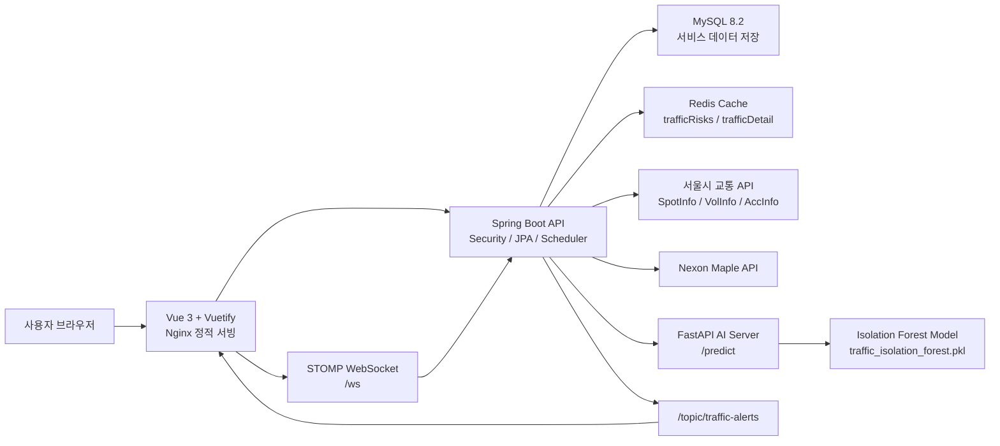
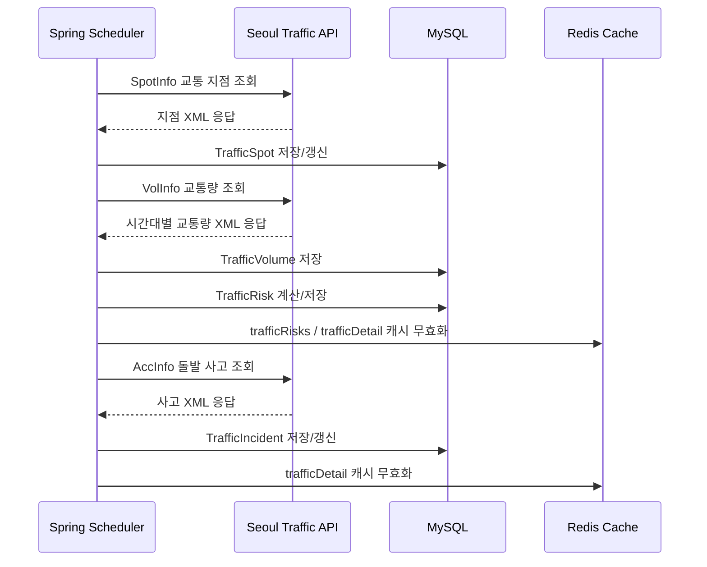
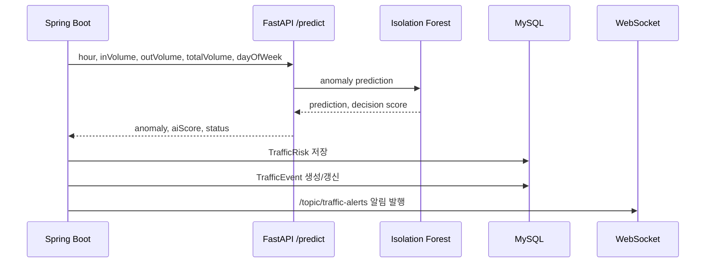

# noAI

## 1. 프로젝트 소개

noAI는 Spring Boot, Vue, FastAPI를 기반으로 한 통합 웹 서비스입니다. 기본 커뮤니티와 마켓 기능에 서울시 교통 데이터 수집, 교통 위험도 분석, AI 이상탐지, 실시간 위험 알림을 결합했습니다.

- 배포 URL: `http://daiswhat.com`
- Backend: Spring Boot API server
- Frontend: Vue 3 SPA
- AI Server: FastAPI 기반 Isolation Forest 예측 서버

## 2. 핵심 기능

- JWT 기반 회원가입/로그인
- 게시판 CRUD 및 이미지 업로드/조회
- 아이템, 인벤토리, 마켓플레이스, 거래 기능
- Maple API 기반 캐릭터 정보 조회
- 서울시 교통 지점/교통량/돌발 사고 데이터 수집
- 평균 교통량 대비 위험도 산정
- Isolation Forest 기반 교통 이상 패턴 탐지
- 돌발 사고 정보와 위험 이벤트 매칭을 통한 원인 추정
- WebSocket/STOMP 기반 실시간 교통 위험 알림
- Swagger UI 기반 API 문서 제공
- Redis Cache 기반 위험도/상세 조회 캐싱

## 3. 아키텍처



```text
noAI/
├─ ai/                  # Spring Boot backend
│  ├─ api/              # city, maple, wow 외부 API 연동
│  ├─ board/            # 게시판
│  ├─ user/             # 사용자
│  ├─ inventory/        # 인벤토리
│  ├─ item/             # 아이템
│  ├─ marketplace/      # 마켓
│  ├─ trade/            # 거래
│  └─ global/           # 보안, 예외, 공통 설정
├─ no-/                 # Vue frontend
├─ pythonAI/            # FastAPI AI server
├─ docker-compose.yml
└─ .env.example
```

## 4. 기술 스택

### Backend

- Java 21
- Spring Boot 4.0.6
- Spring Web MVC
- Spring Security + JWT
- Spring Data JPA
- MySQL 8.2
- Redis Cache
- WebSocket/STOMP
- Springdoc OpenAPI Swagger
- Lombok

### Frontend

- Vue 3
- TypeScript
- Vite
- Vuetify
- Pinia
- Vue Router
- Tailwind CSS
- Axios
- Leaflet + proj4
- SockJS + STOMP

### AI

- Python
- FastAPI
- pandas
- scikit-learn IsolationForest
- joblib

### Infra

- Docker Compose
- MySQL container
- Backend container
- Frontend Nginx container

## 5. 데이터 수집 흐름



수집 스케줄:

- 교통량 수집: 매시 30분
- 돌발 사고 수집: 5분마다

교통 위험 이벤트 원인 추정은 다음 조건으로 수행합니다.

- 위험 상태가 `WARNING` 또는 `DANGER`
- 이벤트 시간대와 사고 지속 시간이 겹침
- 사고 설명(`accInfo`)에 교통 지점의 도로 키워드가 포함됨

## 6. AI 이상탐지 흐름



AI 서버는 `pythonAI/main.py`의 `/predict` 엔드포인트를 제공합니다. Spring backend는 교통량 저장 후 아래 feature를 전송합니다.

- `hour`
- `inVolume`
- `outVolume`
- `totalVolume`
- `dayOfWeek`

AI 응답:

- `anomaly`: 이상 패턴 여부
- `aiScore`: Isolation Forest decision score
- `status`: `ANOMALY` 또는 `NORMAL`

## 7. API 문서 Swagger

Springdoc OpenAPI로 Swagger UI를 제공합니다.

- 배포 Swagger UI: `http://daiswhat.com/swagger-ui/index.html`
- 배포 OpenAPI JSON: `http://daiswhat.com/v3/api-docs`
- 로컬 Swagger UI: `http://localhost:8080/swagger-ui/index.html`
- 로컬 OpenAPI JSON: `http://localhost:8080/v3/api-docs`

주요 Traffic API:

| Method | Path | Description |
| --- | --- | --- |
| GET | `/api/traffic/spot?ymd={yyyyMMdd}&hour={hour}` | 지점별 교통량 수집/조회 |
| GET | `/api/traffic/volumes?spotNum={spotNum}&ymd={yyyyMMdd}` | 특정 지점 시간대별 교통량 |
| GET | `/api/traffic/risk?spotNum={spotNum}&ymd={yyyyMMdd}&hour={hour}` | 특정 지점 위험도 |
| GET | `/api/traffic/risks?ymd={yyyyMMdd}&hour={hour}` | 전체 지점 위험도 |
| GET | `/api/traffic/details/{spotNum}?ymd={yyyyMMdd}&hour={hour}` | 지점 상세 분석 |
| GET | `/api/traffic/events` | 위험 이벤트 목록 |
| GET | `/api/traffic/dataset` | AI 학습/분석용 데이터셋 |

기타 주요 API:

| Method | Path | Description |
| --- | --- | --- |
| POST | `/user/signup` | 회원가입 |
| POST | `/user/login` | 로그인 및 JWT 발급 |
| GET | `/board` | 게시글 목록 조회 |
| POST | `/board` | 게시글 작성 및 이미지 업로드 |
| GET | `/board/{id}` | 게시글 상세 조회 |
| GET | `/maple/id` | 메이플 캐릭터 정보 조회 |

WebSocket:

- Endpoint: `/ws`
- Topic: `/topic/traffic-alerts`
- Payload: `TrafficAlertDto`

## 8. 트러블슈팅

개발 중 겪은 문제와 해결 과정은 별도 문서로 정리했습니다.

- [트러블슈팅 문서](docs/troubleshooting.md)

## 9. 실행 방법 Docker Compose

### 환경 변수 준비

루트에 `.env` 파일을 만들고 `.env.example`을 참고해 값을 채웁니다.

```env
APP_PORT=80
MYSQL_PORT=3306
MYSQL_DATABASE=noai
MYSQL_ROOT_PASSWORD=change-me
SPRING_JPA_HIBERNATE_DDL_AUTO=update
JWT_SECRET=change-me-base64-secret
```

외부 API를 사용할 경우 백엔드 실행 환경에 아래 값도 필요합니다.

```env
SERVICE_KEY=서울시_API_서비스키
MAPLE_API_KEY=넥슨_메이플_API_키
MAPLE_BASE_URL=메이플_API_BASE_URL
WOW_API_KEY=WOW_API_KEY
WOW_BASE_URL=WOW_API_BASE_URL
```

### Docker Compose 실행

```bash
docker compose up --build
```

기본 접속 주소:

- Frontend: `http://localhost`
- Backend: Docker 내부 `8080`
- MySQL: `localhost:3306`

### AI 서버 로컬 실행

Docker Compose는 현재 FastAPI AI 서버를 포함하지 않습니다. 교통 이상탐지를 사용하려면 별도로 실행합니다.

```bash
cd pythonAI
pip install fastapi uvicorn pandas scikit-learn joblib
uvicorn main:app --host 0.0.0.0 --port 8000
```

### 빌드 검증

Backend:

```bash
cd ai
./gradlew.bat compileJava
```

Frontend:

```bash
cd no-
npm install
npm run build
```

### 주의 사항

- `application.yaml`의 JPA 설정은 `ddl-auto: update`입니다.
- `PhysicalNamingStrategyStandardImpl`을 사용하므로 일부 테이블/컬럼명이 Java 필드명과 동일한 CamelCase로 생성될 수 있습니다.
- AI 서버가 실행 중이지 않으면 교통 위험도 저장 중 `/predict` 호출이 실패할 수 있습니다.
- Docker Compose에는 Redis 서비스가 포함되어 있지 않습니다.
- `pythonAI/traffic_model.py`에는 개발용 토큰 예시가 포함되어 있으므로 실제 배포 전 민감 정보 제거가 필요합니다.
