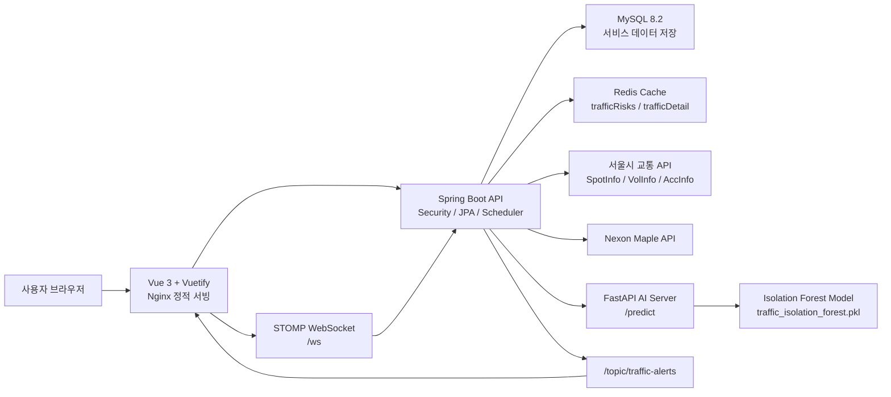
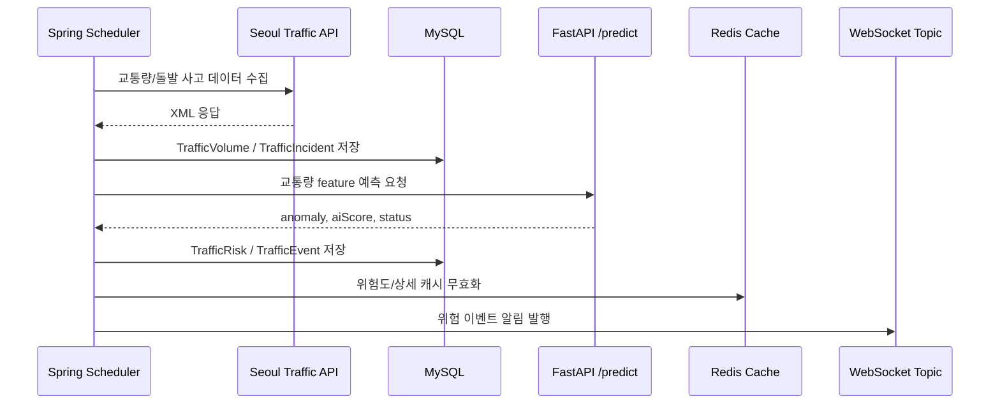

# noAI

Spring Boot, Vue, FastAPI 기반의 통합 웹 서비스입니다. 기본 커뮤니티/마켓 기능에 서울시 교통 데이터, 위험도 분석, AI 이상 탐지, 실시간 알림을 결합한 프로젝트입니다.

## 주요 기능

- 회원가입/로그인 및 JWT 기반 인증
- 게시판 CRUD 및 이미지 업로드/조회
- 아이템, 인벤토리, 마켓플레이스, 거래 기능
- Maple API 연동 캐릭터 정보/스탯 조회
- 서울시 교통 지점/교통량/돌발 사고 정보 수집
- 교통량 평균 대비 위험도 산정
- Isolation Forest 기반 교통 이상 패턴 탐지
- 위험 이벤트 원인 추정 메시지 생성
- WebSocket/STOMP 기반 교통 위험 알림
- Swagger UI 기반 API 문서

## 기술 스택

### Backend

- Java 21
- Spring Boot 4.0.6
- Spring Web MVC
- Spring Security + JWT
- Spring Data JPA
- MySQL 8.2
- Redis Cache
- WebSocket/STOMP
- Springdoc OpenAPI Swagger
- Lombok

### Frontend

- Vue 3
- TypeScript
- Vite
- Vuetify
- Pinia
- Vue Router
- Tailwind CSS
- Axios
- Leaflet + proj4
- SockJS + STOMP

### AI

- Python
- FastAPI
- pandas
- scikit-learn IsolationForest
- joblib

### Infra

- Docker Compose
- MySQL container
- Backend container
- Frontend Nginx container

## 프로젝트 구조

```text
noAI/
├─ ai/                  # Spring Boot backend
│  ├─ src/main/java/com/no/ai/
│  │  ├─ api/           # 외부 API 연동: city, maple, wow
│  │  ├─ board/         # 게시판
│  │  ├─ user/          # 사용자
│  │  ├─ inventory/     # 인벤토리
│  │  ├─ item/          # 아이템
│  │  ├─ marketplace/   # 마켓
│  │  ├─ trade/         # 거래
│  │  └─ global/        # 보안, 예외, 공통 설정
│  └─ src/main/resources/application.yaml
├─ no-/                 # Vue frontend
│  ├─ src/api/          # API client
│  ├─ src/components/   # 공통 컴포넌트
│  ├─ src/pages/        # 라우팅 페이지
│  └─ src/router/
├─ pythonAI/            # FastAPI AI server
│  ├─ main.py           # /predict endpoint
│  ├─ traffic_model.py  # Isolation Forest 학습 스크립트
│  └─ traffic_isolation_forest.pkl
├─ docker-compose.yml
└─ .env.example
```

## 실행 방법

### 1. 환경 변수 준비

루트에 `.env` 파일을 만들고 `.env.example`을 참고해 값을 채웁니다.

```env
APP_PORT=80
MYSQL_PORT=3306
MYSQL_DATABASE=noai
MYSQL_ROOT_PASSWORD=change-me
SPRING_JPA_HIBERNATE_DDL_AUTO=update
JWT_SECRET=change-me-base64-secret
```

교통/게임 외부 API를 사용할 경우 백엔드 실행 환경에 아래 값도 필요합니다.

```env
SERVICE_KEY=서울시_API_서비스키
MAPLE_API_KEY=넥슨_메이플_API_키
MAPLE_BASE_URL=메이플_API_BASE_URL
WOW_API_KEY=WOW_API_KEY
WOW_BASE_URL=WOW_API_BASE_URL
```

### 2. Docker Compose 실행

```bash
docker compose up --build
```

기본 접속 주소:

- Frontend: `http://localhost`
- Backend: Docker 내부 `8080`
- MySQL: `localhost:3306`

### 3. 로컬 개발 실행

Backend:

```bash
cd ai
./gradlew.bat bootRun
```

Frontend:

```bash
cd no-
npm install
npm run dev
```

AI server:

```bash
cd pythonAI
pip install fastapi uvicorn pandas scikit-learn joblib
uvicorn main:app --host 0.0.0.0 --port 8000
```

Spring backend는 AI 예측을 `http://localhost:8000/predict`로 호출합니다.

## 주요 API

### Auth/User

| Method | Path | Description |
| --- | --- | --- |
| POST | `/user/signup` | 회원가입 |
| POST | `/user/login` | 로그인 및 JWT 발급 |

### Board

| Method | Path | Description |
| --- | --- | --- |
| GET | `/board` | 게시글 목록 조회 |
| POST | `/board` | 게시글 작성 및 이미지 업로드 |
| PUT | `/board` | 게시글 수정 |
| DELETE | `/board?id={id}` | 게시글 삭제 |
| GET | `/board/{id}` | 게시글 상세 조회 |
| GET | `/board/image/{id}` | 게시글 이미지 조회 |

### Traffic

| Method | Path | Description |
| --- | --- | --- |
| GET | `/api/traffic/spot?ymd={yyyyMMdd}&hour={hour}` | 지점별 교통량 수집/조회 |
| GET | `/api/traffic/volumes?spotNum={spotNum}&ymd={yyyyMMdd}` | 특정 지점 시간대별 교통량 |
| GET | `/api/traffic/risk?spotNum={spotNum}&ymd={yyyyMMdd}&hour={hour}` | 특정 지점 위험도 |
| GET | `/api/traffic/risks?ymd={yyyyMMdd}&hour={hour}` | 전체 지점 위험도 |
| GET | `/api/traffic/details/{spotNum}?ymd={yyyyMMdd}&hour={hour}` | 지점 상세 분석 |
| GET | `/api/traffic/events` | 위험 이벤트 목록 |
| GET | `/api/traffic/dataset` | AI 학습/분석용 데이터셋 |

### Maple

| Method | Path | Description |
| --- | --- | --- |
| GET | `/maple/id` | 메이플 캐릭터 식별자/정보 조회 |

## 교통 위험 분석 흐름

1. 서울시 교통 지점과 시간대별 교통량을 수집합니다.
2. 지점별 평균 교통량과 현재 교통량을 비교해 위험 점수를 계산합니다.
3. 위험 점수에 따라 `NORMAL`, `WARNING`, `DANGER` 상태를 부여합니다.
4. FastAPI AI 서버에 교통량 특성을 보내 Isolation Forest 이상 탐지를 수행합니다.
5. 서울시 돌발 사고 정보를 주기적으로 수집합니다.
6. 위험 이벤트 시간대와 사고 지속 시간이 겹치고, 사고 설명에 도로 키워드가 포함되면 원인으로 추정합니다.
7. 위험 이벤트를 저장하고 WebSocket으로 알림을 발행합니다.

스케줄:

- 교통량 수집: 매시 30분
- 돌발 사고 수집: 5분마다

## 2. 아키텍처 다이어그램





## 3. 트러블슈팅 정리

| 문제 | 원인 | 해결 |
| --- | --- | --- |
| `TrafficEvent`에 사고 원인이 표시되지 않음 | 위험 이벤트 생성 시 `aiAnomaly=true`인 경우에만 `TrafficIncident`를 조회함 | `WARNING`/`DANGER`이면 AI 이상 여부와 관계없이 사고 정보를 먼저 조회하도록 변경 |
| 사고 정보가 실제 영향 시간대와 매칭되지 않음 | `occurTime BETWEEN startTime AND endTime`만 사용해서 이미 발생해 지속 중인 사고를 놓침 | `occurTime <= endTime` 그리고 `expectedClearTime >= startTime` 조건으로 사고 지속 구간 overlap 매칭 적용 |
| 지점명 때문에 사고 정보가 매칭되지 않음 | `성산로(금화터널)` 같은 전체 지점명으로 `accInfo LIKE` 검색 | 괄호 앞 도로명만 추출하는 `extractRoadKeyword()` 적용 |
| 교통 상세 메시지에 동일한 원인 블록이 반복 출력됨 | 5분마다 도는 사고 업데이트가 기존 메시지에 계속 append | 메시지를 append하지 않고 `buildEventMessage()`로 매번 재생성해 덮어쓰기 |
| 같은 지점/날짜/시간 이벤트가 중복 저장됨 | 위험도 계산 시 매번 `TrafficEvent.create()` 호출 | 기존 최신 이벤트를 조회한 뒤 있으면 update, 없으면 create |
| Swagger에서 Traffic API 설명이 부족함 | 일부 엔드포인트에만 `@Operation` 존재 | Traffic Controller와 DTO에 `@Operation`, `@Parameter`, `@ApiResponse`, `@Schema` 보강 |
| AI 예측 실패 | Spring backend가 `http://localhost:8000/predict`를 호출하지만 FastAPI 서버가 실행되지 않음 | `pythonAI`에서 `uvicorn main:app --host 0.0.0.0 --port 8000` 실행 |
| Redis 연결 실패 가능성 | `application.yaml`은 Redis cache를 사용하지만 Docker Compose에는 Redis 서비스가 없음 | 로컬/배포 환경에 Redis를 별도 실행하거나 cache 설정을 환경에 맞게 조정 |

## 4. 성능/캐싱 적용 결과 정리

### 적용 지점

- `@EnableCaching`으로 Spring Cache 활성화
- Redis Cache 사용 설정: `spring.cache.type=redis`
- 전체 지점 위험도 조회 캐싱
  - cache name: `trafficRisks`
  - key: `ymd:hour`
  - 대상: `/api/traffic/risks`
- 교통 지점 상세 조회 캐싱
  - cache name: `trafficDetail`
  - key: `spotNum:ymd:hour`
  - 대상: `/api/traffic/details/{spotNum}`

### 기대 효과

- 지도 화면에서 같은 날짜/시간의 전체 위험도를 반복 조회할 때 DB 조회와 DTO 조립 비용을 줄입니다.
- 상세 패널을 열고 닫거나 같은 지점을 다시 조회할 때 시간대별 교통량, 위험도, 메시지 조합 결과를 재사용합니다.
- 교통 지점 수가 늘어날수록 `/risks` 응답에서 캐시 효과가 커집니다.

### 캐시 무효화 전략

- 매시 30분 교통량 수집 후 `trafficRisks`, `trafficDetail` 캐시를 비웁니다.
- 5분마다 돌발 사고 정보를 갱신한 뒤 `trafficDetail` 캐시를 비웁니다.
- 위험도 지도 데이터는 교통량 수집 단위로 갱신하고, 상세 메시지는 사고 정보 갱신 단위로 반영되도록 분리했습니다.

### 현재 한계

- 정량 성능 수치는 별도 부하 테스트 결과가 아직 없습니다.
- Redis가 Docker Compose에 포함되어 있지 않아 배포 환경에서 Redis 실행 여부를 함께 확인해야 합니다.
- 캐시 TTL 설정은 명시되어 있지 않고, 현재는 수집/갱신 시점의 수동 clear 중심입니다.

## 5. 배포 URL 정리

- 서비스 URL: `http://daiswhat.com`
- Swagger UI: `http://daiswhat.com/swagger-ui/index.html`
- OpenAPI JSON: `http://daiswhat.com/v3/api-docs`
- WebSocket endpoint: `http://daiswhat.com/ws`

## WebSocket

- Endpoint: `/ws`
- Topic: `/topic/traffic-alerts`
- Payload: `TrafficAlertDto`

위험 이벤트 발생 시 프론트엔드는 STOMP 구독을 통해 실시간 알림을 받을 수 있습니다.

## Swagger

Springdoc OpenAPI가 설정되어 있습니다.

- Swagger UI: `http://localhost:8080/swagger-ui/index.html`
- OpenAPI JSON: `http://localhost:8080/v3/api-docs`

## 빌드 및 검증

Backend compile:

```bash
cd ai
./gradlew.bat compileJava
```

Frontend build:

```bash
cd no-
npm run build
```

## 주의 사항

- `application.yaml`의 JPA 설정은 `ddl-auto: update`입니다. 운영 환경에서는 migration 도구 사용을 권장합니다.
- `PhysicalNamingStrategyStandardImpl`을 사용하므로 일부 테이블/컬럼명이 Java 필드명과 동일한 CamelCase로 생성될 수 있습니다.
- AI 서버가 실행 중이지 않으면 교통 위험도 저장 중 `/predict` 호출이 실패할 수 있습니다.
- Docker Compose에는 Redis 서비스가 포함되어 있지 않습니다. Redis 캐시를 사용할 경우 별도 Redis 실행 또는 설정 변경이 필요합니다.
- `pythonAI/traffic_model.py`에는 개발용 토큰 예시가 포함되어 있으므로 실제 배포 전 민감 정보 제거가 필요합니다.
